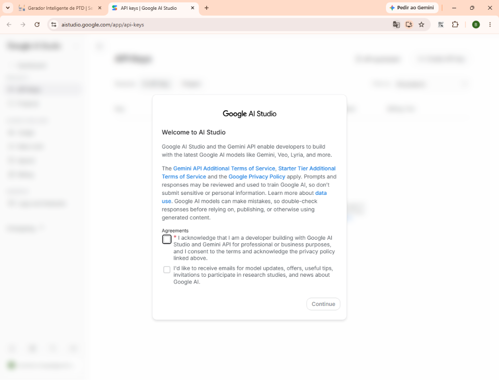
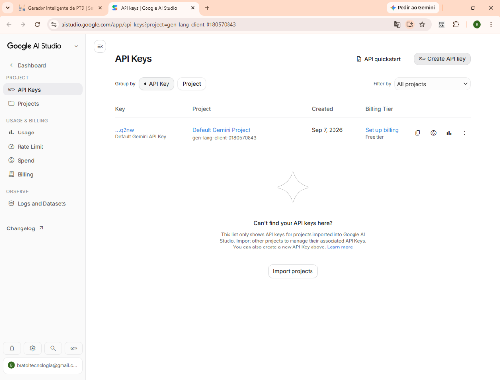
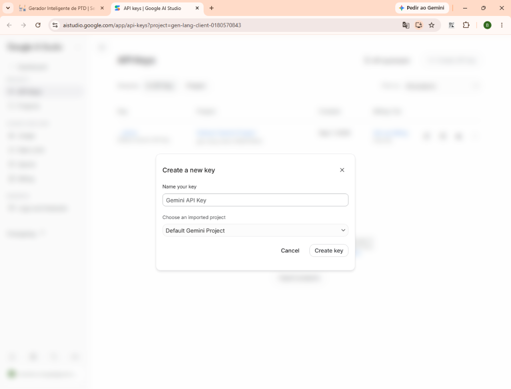
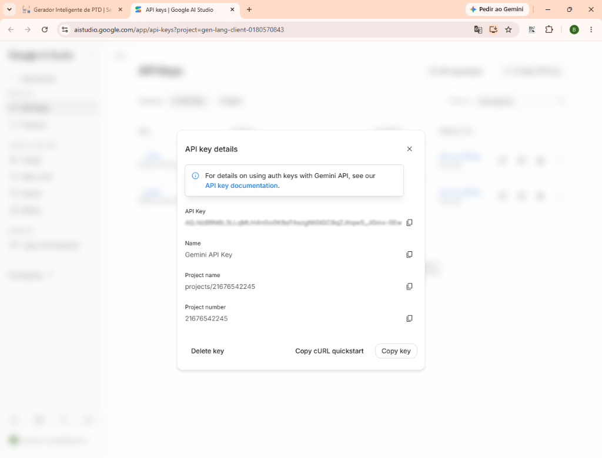
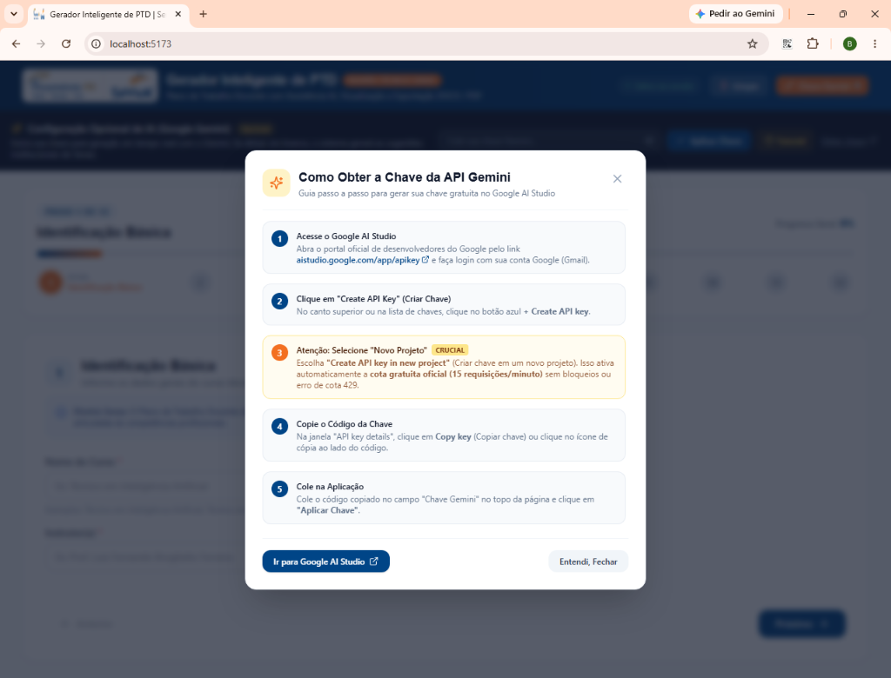

# 📖 Tutorial: Como Obter e Configurar sua Chave Gratuita da API Google Gemini

Este guia orienta passo a passo como gerar sua chave de API pessoal e gratuita no **Google AI Studio** para utilizar o preenchimento assistido por inteligência artificial no **Gerador Inteligente de PTD Senac**.

---

## ⚡ Resumo Rápido

1. Acesse: [https://aistudio.google.com/app/apikey](https://aistudio.google.com/app/apikey)
2. Faça login com sua conta Google (Gmail).
3. Clique no botão azul **`+ Create API key`** (Criar chave de API).
4. **⚠️ Passo Crucial:** Selecione a opção **"Create API key in new project"** *(Criar chave em um novo projeto)*.
5. Copie a chave gerada (**Copy key**).
6. Cole na aplicação e clique em **"Aplicar Chave"**.

---

## 📝 Passo a Passo Detalhado

### Passo 1: Acessar o Google AI Studio e Aceitar os Termos
- Abra seu navegador e entre no link oficial: **[aistudio.google.com/app/apikey](https://aistudio.google.com/app/apikey)**.
- Faça login com sua conta Google (Gmail).
- Se for seu primeiro acesso, marque a confirmação dos termos de uso e clique em **Continue**.

---

### Passo 2: Criar a Chave de API
- Na tela principal de **API keys**, localize o botão no canto superior direito:
  > **`+ Create API key`** (ou **Criar chave de API**)

---

### Passo 3: Escolha do Projeto (MUITO IMPORTANTE!)
Ao clicar para criar a chave, o Google exibirá a janela **"Create a new key"**:

> 💡 **RECOMENDAÇÃO OBRIGATÓRIA:**
> - Digite um nome para sua chave (ex: `Gemini API Key`).
> - No campo **Choose an imported project**, selecione o projeto padrão ou **"Create API key in new project"**.
> - **Por que fazer isso?** Projetos novos ou o padrão do Google AI Studio recebem automaticamente a **cota gratuita oficial** (15 requisições por minuto no modelo Flash) sem custos ou cartão de crédito. Se você vincular a um projeto antigo do Google Cloud que não possua cotas de IA habilitadas, a API responderá com o erro `429 - Quota exceeded`.
> - Clique no botão azul **Create key**.

---

### Passo 4: Copiar a Chave Gerada
- Após alguns segundos, abrirá a janela pop-up intitulada **"API key details"** (Detalhes da chave de API).
- Você verá o campo **API Key** com o código da sua chave.
- Clique no botão **`Copy key`** no canto inferior ou no ícone de cópia ao lado do código.

---

### Passo 5: Inserir no Gerador de PTD Senac
1. Abra o **Gerador Inteligente de PTD**.
2. No topo da tela (cabeçalho), clique no botão laranja **`Chave Gemini`**.
3. A gaveta de configuração será aberta:
   - Cole sua chave copiada no campo de texto.
   - Clique no botão azul **`Aplicar Chave`**.
4. Uma notificação verde confirmará: *"Chave Gemini salva na sessão!"*.
5. A bolinha de status ao lado do botão passará a ficar **verde**, indicando que a chave está ativa.

---

## ❓ Perguntas Frequentes & Resolução de Problemas (Troubleshooting)

### 1. A chave é cobrada?
**Não.** O Google AI Studio oferece um plano gratuito permanente (*Free Tier*) com até 15 requisições por minuto (`15 RPM`) e 1.500 requisições por dia nos modelos `gemini-1.5-flash` e `gemini-2.0-flash`. Para uso na elaboração de planos de aula e PTDs, essa cota é mais do que suficiente.

### 2. O que fazer se aparecer a mensagem de erro ou cota excedida (Erro 429)?
- O erro `429 Quota exceeded` ocorre principalmente quando a chave foi criada associada a um projeto Google Cloud pré-existente sem cotas ativas de IA generativa.
- **Como resolver em 1 minuto:**
  1. Acesse novamente [aistudio.google.com/app/apikey](https://aistudio.google.com/app/apikey).
  2. Clique em **`+ Create API key`**.
  3. Escolha **"Create API key in new project"**.
  4. Copie a nova chave gerada e cole no Gerador de PTD.

### 3. Preciso colocar a chave toda vez que abrir o gerador?
A chave fica salva temporariamente na sua sessão do navegador (`sessionStorage`). Se você fechar todas as abas e reabrir outro dia, basta colar novamente.

### 4. E se eu não tiver uma chave ou não quiser criar?
O Gerador de PTD funciona perfeitamente sem chave! Quando nenhuma chave é informada, o sistema aciona o motor de sugestões pedagógicas institucionais integradas do Senac.
